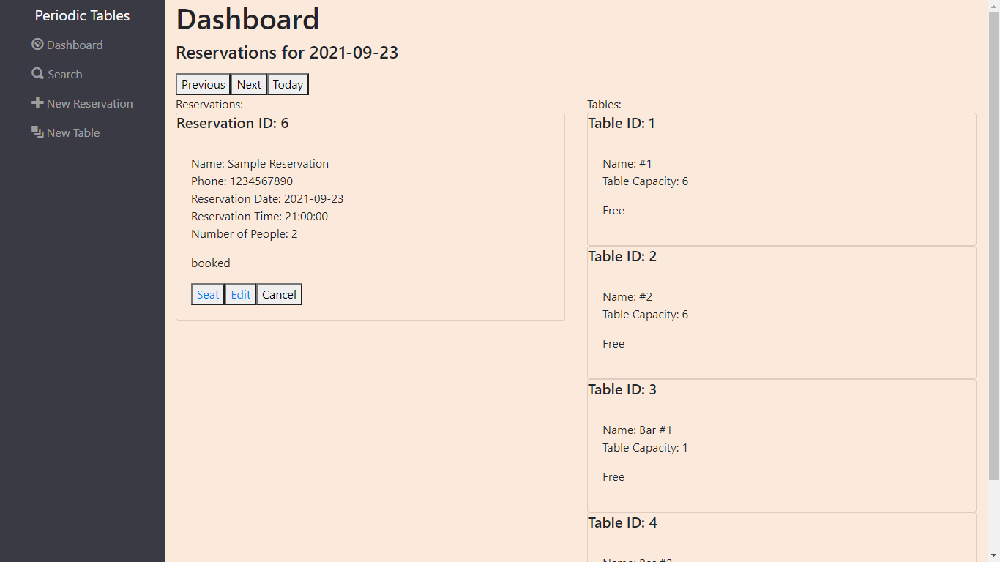
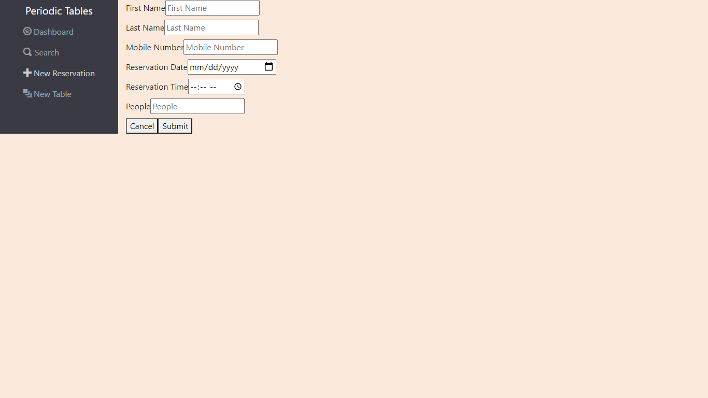
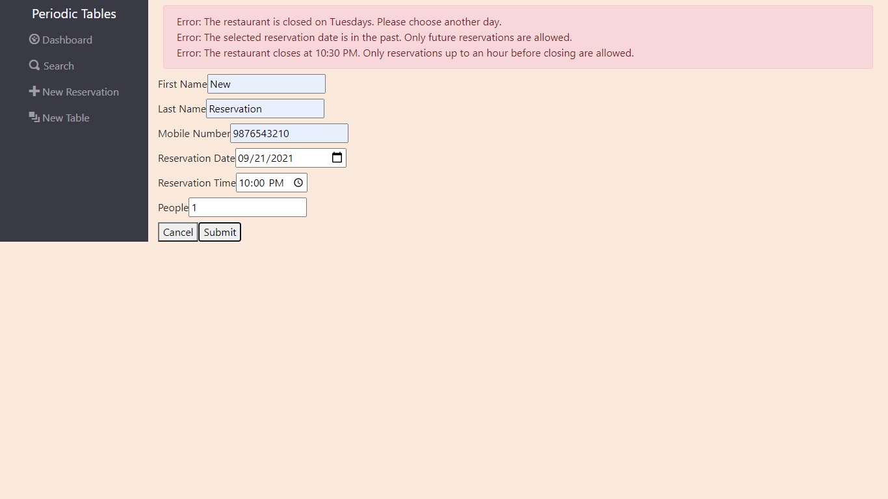
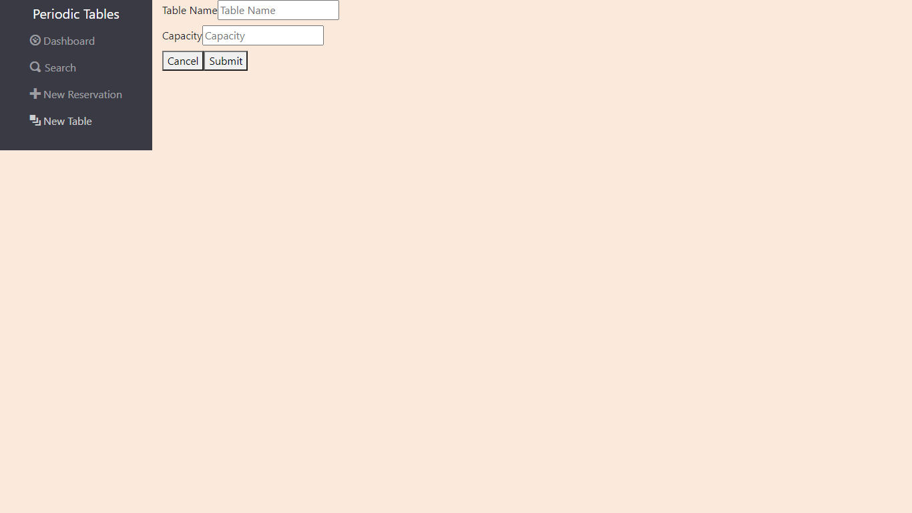
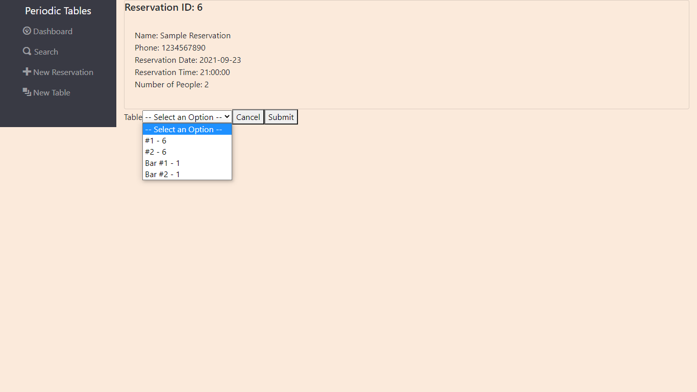
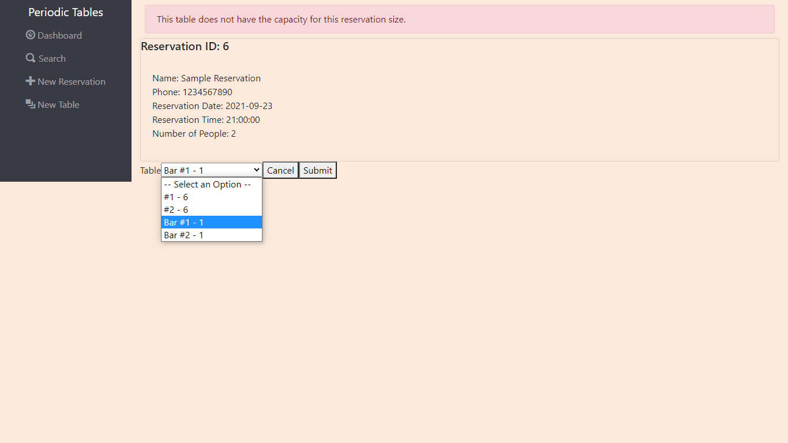
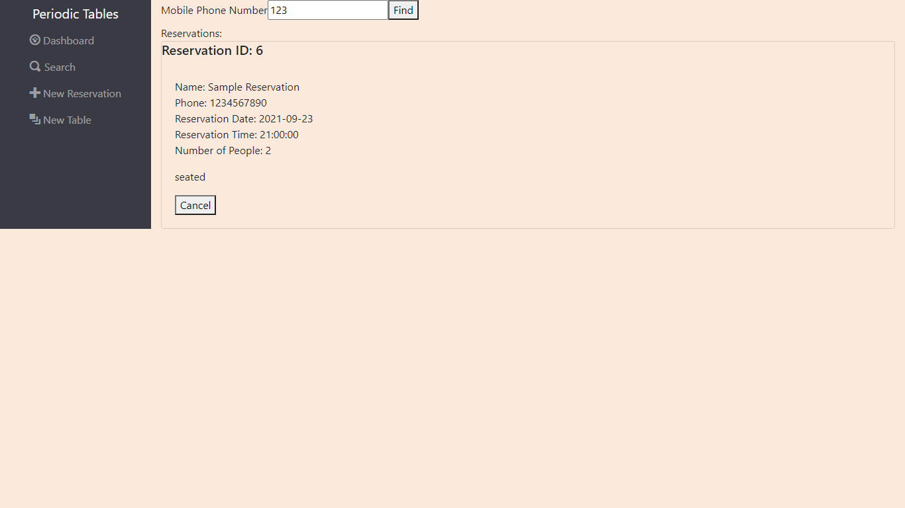
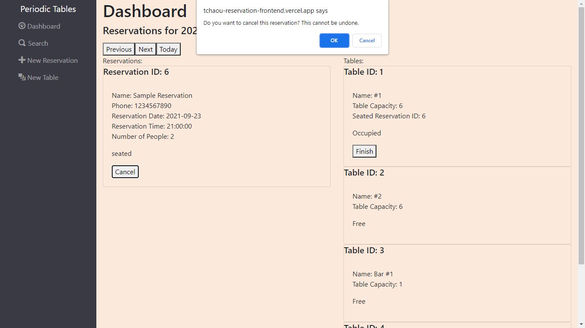

# Capstone: Periodic Tables

Periodic Tables is a restaurant reservation system app for restaurant managers to create, manage, and track reservations and the tables to seat them. Restaurant personell can use the software whenever customers call to request or inquire about their reservations.

## Link

[Live Demo](https://tchaou-reservation-frontend.vercel.app/)

## Screenshots

### Dashboard:

The dashboard page lists all reservations for a single date and all available tables. The date is defaulted to today, and the reservations are sorted by time. The "Next", "Previous", and "Today" buttons allow the user to see reservations on other dates. Each table displays "Free" or "Occupied" depending on whether a reservation is seated at the table. Each reservation displays a status of "booked", "seated", "finished", or "cancelled". The default status when a reservation is made is "booked". Only a "booked" reservation has the option of being seated, which changes the status of the reservation to "seated". When the table that has a "seated" reservation is finished, the status of the reservation becomes "finished". A customer who made a reservation can request for his reservation to be cancelled, and then the manager can set the status of that reservation to "cancelled". Only "booked" and "seated" reservations are shown on the dashboard.

### Add New Reservation/Update Existing Reservation:

Create a new reservation or edit an existing one; every field is required to be filled out before the form can be submitted. Only reservations with a status of "booked" can be edited. The same constraints that apply to creating a new reservation also apply to editing an existing one.

A restaurant manager can create a new reservation when a customer calls so that he knows how many customers will arrive at the restaurant on a given day, or he can modify a reservation if a customer calls to change or cancel his reservation so that reservations remain accurate and current.

### Information About Invalid Details for Reservation Creation

The New Reservation page displays an informative error message if any important constraints are violated.

A restaurant manager can choose to only allow reservations to be made in advance during open business hours on a day when his restaurant is open so that users do not accidentally create a reservation for days when his business is closed or for a time when they cannot accommodate customers.

### Add New Table:

Create a new table; every field is required to be filled out before the form can be submitted.

A restaurant manager can update the application with a new table so that he has an up-to-date listing of all the available seating.

### Seat Reservation

Choose a table to seat an existing reservation.

When a customer with an existing reservation arrives at the restaurant, the restaurant manager can seat the reservation at a specific table and assign the reservation to that table in the application so that he can know which tables are occupied and free.

### Prevention of Impossible Seating

The app will prevent a reservation with more people than the capacity of a certain table from being seated at that table.

### Finish Occupied Table

Each occupied table in the dashboard displays a "Finish" button. Clicking the "Finish" button will cause the app to request confirmation for finishing that table. If the user selects "OK", the system will remove the reservation assigned to that table and change the reservation's status to "finished". Clicking the "Cancel" button cancels the process without making any changes.

A restaurant manager can free up an occupied table when the guests leave so that he can seat new guests at that table. The finished reservations are then hidden from the dashboard.

### Search Reservations by Phone Number

Enter a phone number or a fragment of one and the application will display all reservations matching the phone number or phone number fragment, regardless of status. If there are no records found, then "No reservations found" will be displayed on the page.

A restaurant manager can search for a reservation by phone number (partial or complete) so that he can quickly access customers' reservations when they call about their reservation.

### Cancel Reservation

Each reservation that is visible on the dashboard displays a "Cancel" button. Clicking the "Cancel" button will cause the app to request confirmation for cancelling that reservation. If the user selects "OK", the system will set the reservation's status to "cancelled", and that reservation will be hidden from the dashboard. Clicking the "Cancel" button cancels the process without making any changes.

## Technology

### Built with:

- React, including Router
  - Created with [create-react-app](https://github.com/facebook/create-react-app)
- Node.js
  - CORS for safer request headers
- Express
- PostgreSQL
  - Knex.js for query building
- JavaScript
- HTML
- CSS
- Vercel
- Heroku
- Testing on Jest framework using Puppeteer and Supertest

## API Documentation

In following with REST best practices, get requests return JSON responses. Post and put requests require an application/json body and return a JSON reponse.

### Endpoints for reservation entries and management:

**Get By Date:** `GET /reservations?date=YYYY-MM-DD`

- `YYYY-MM-DD` must be replaced with the desired date
- Requests all reservations for the specified date query
- Successful get request will return a status code of 200 and an array of JSON objects representing the saved reservations, each containing the following fields:
  - `reservation_id`: integer
  - `first_name`: string
  - `last_name`: string
  - `mobile_number`: string
  - `reservation_date`: date
  - `reservation_time`: time
  - `people`: integer greater than 0
  - `created_at`: date
  - `updated_at`: date
- Default value of the current day (today) applied to the date query if not supplied from the front end

**Post Reservation:** `POST /reservations`

- Posts a single JSON object
  - Post body must contain a JSON object representing the desired reservation to be created, containing the following fields:
    - `first_name`: string
    - `last_name`: string
    - `mobile_number`: string
    - `reservation_date`: date
    - `reservation_time`: time
    - `people`: integer greater than 0
  - Default value of "booked" is applied for `status`
  - Current date and time are automatically applied for `created_at` and `updated_at`
  - `reservation_id` derived from the backend database
- Successful post request will return a status code of 201 and JSON of the posted object

**Get By ID:** `GET /reservations/reservation_id`

- `reservation_id` must be replaced with the desired reservation's ID
- Requests the reservation with the specified ID
- Successful get request will return a status code of 200 and a JSON object representing the saved reservation
  - See above "Get By Date" section for content's data types.

**Update Reservation:** `PUT /reservations/reservation_id`

- `reservation_id` must be replaced with the desired reservation's ID
- Puts a single JSON object
  - Put body must contain a JSON object representing the desired updated reservation to be saved
  - See above "Post Reservation" section for data type requirements
- Successful put request will return a status code of 200 and JSON of the saved object

**Update Reservation Status:** `PUT /reservations/reservation_id/status`

- `reservation_id` must be replaced with the desired reservation's ID
- Puts a single JSON object
  - Put body must contain a JSON object representing the desired status for the reservation to be updated to, containing the following field:
    - `status`: string equal to "booked", "seated", "finished", or "cancelled".
- Successful put request will return a status code of 200 and JSON of the saved object

### Endpoints for table entries and management:

**Get List:** `GET /tables`

- Requests all tables
- Successful get request will return a status code of 200 and an array of JSON objects representing the saved tables, each containing the following fields:
  - `table_id`: integer
  - `table_name`: string
  - `capacity`: integer greater than 0
  - `reservation_id`: integer
  - `created_at`: date
  - `updated_at`: date

**Post Table:** `POST /tables`

- Posts a single JSON object
  - Post body must contain a JSON object representing the desired table to be created, containing the following fields:
    - `table_name`: string
    - `capacity`: integer greater than 0
  - Null value applied to `reservation_id` if not supplied
  - Current date and time are automatically applied for `created_at` and `updated_at`
  - `table_id` derived from the backend database
- Successful post request will return a status code of 201 and JSON of the posted object

**Update Table by Adding Reservation:** `PUT /tables/table_id/seat`

- `table_id` must be replaced with the desired table's ID
- Puts a single JSON object
  - Put body must contain a JSON object representing the desired reservation to be added to the table, containing the following field:
    - `reservation_id`: integer
- Successful put request will return a status code of 200 and JSON of the saved ID

**Delete Reservation from Table:** `DELETE /tables/table_id/seat`

- `table_id` must be replaced with the desired table's ID
- Sends a delete request for the table with the specified ID
- Successful delete request will return a status code of 200 and JSON of an empty object

## Installation Instructions

1. Run `cp ./back-end/.env.sample ./back-end/.env`.
1. Update the `./back-end/.env` file with the connection URL to your database instance.
1. Run `cp ./front-end/.env.sample ./front-end/.env`.
1. Update the `./front-end/.env` file with the connection URL to the API.
1. Run `npm install` to install project dependencies.
1. Run `npm run start` to start your server and app.

## About Me

- [Personal Portfolio](https://stephenengineer.github.io/portfolio/)
- [GitHub Profile](https://github.com/stephenengineer)
- [Twitter](https://twitter.com/StephenTchaou)

# Special Thanks

Special thanks to Thinkful for various pieces of guidance and inspiration.
